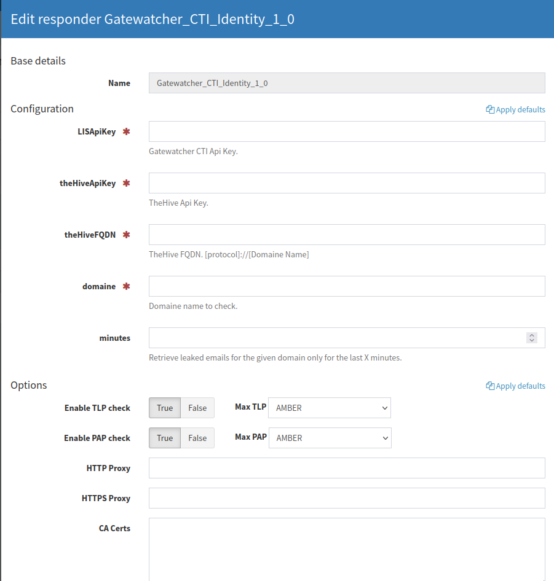
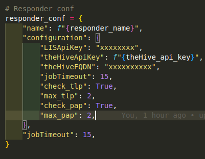

# Gatewatcher CTI Identity

### What does this responder do?
During a run, the responder (associated with a case) checks for leaked emails related to a specific domain within a specified timeframe. 
  - For each leaked email found, an alert is raised containing detailed information in the description field, and the email is added as an observable. Each alert is linked to the case, and the alert observables are added to the case observables.
  - If an alert is raised for a leaked email that already exists and is linked to another case, the alert description is updated with the latest information. The alert is unlinked from the previous case and linked to the current case. The previous case retains the email as an observable.

## Basic Workflows
### Unique run 
  - The responder can be run once directly from the 'theHive' interface. From a case, you can select the responder and run it. The responder will execute with the configuration set in the 'Cortex responder configuration' interface.

  ### Add to a task manager
  - To automate the responder execution, you can add it to a task manager or cron job. This ensures the responder runs at regular intervals with the specified configuration.
  - Step 1 (Optionnal):
    - Execute the script manually with a sufficiently large value for the `minutes` argument to retrieve initial leaks. This will create a case containing leaked emails, which can serve as a starting point.
  - Step 2 :
    - Add the script to a task manager with the correct value for the `minutes` argument. Ensure that this value matches the interval set in the task manager. For example, if the task manager is configured to run the script every 30 minutes, set the `minutes` argument to `30` when running the script.
  - For each runs, a case on theHive will be create and alerts will be linked to it. If a case does not raise alerts, the case will be delete (You will be able to see the run in 'Cortex' job history).

## How to enable the responder on Cortex interface
- Manually:
  - To enable Gatewatcher_CTI_Identity responder:
    - Navigate to "Organization" -> "Responders"
    - Refresh responders to ensure that you have the lastest version.
    - Search for "Gatewatcher_CTI_Identity".
    - Enable it and configure its parameters (to run it automatically at regular intervals, set a value in "minutes" parameter).
    
- With the script:
  - When the script is executed, the responder will use the configuration specified in the `responder_conf` variable within the script.
  - 
    - When running the script, the `minutes` argument is mandatory. To retrieve all leaked emails for a given domain, configure the responder on Cortex and execute it manually within a case.

- The job can take time to finish, so to avoid timeouts, adjust the timeout parameters. By default, the timeout is set to 15 minutes.   

## How to edit the script
- A script is available in the "script" directory to allow you to automate the execution of the responder.
  - This script will take two mandatory parameters `domain_name` and `minutes`(integer).
    - For exemple, to run the script for `XYZ` domain and get email leaks for the past `10` minutes:
      - `path/to/bin/python3 /path/to/the/script/script.py XYZ 10`
  - Modify the following variables with your information:
    - For theHive:
      - `theHive_fqdn`
      - `theHive_api_key`
    - For Cortex:
      - `cortex_fqdn`
      - `cortex_api_key`
      - In responder_conf (You can also edit other parameters): 
        - `LISApiKey`
        - `theHiveFQDN` 
- Make the script executable:
  - Run : `chmod +x /path/of/the/script/script.py`

## How to Setup the script in a cron/task manager

- Add this script to a cron/task manager to run it automatically at regular intervals. 
  - For exemple, to run it every 30 minutes on Linux:
    - Add the script to the 'crontab': 
      - Edit the cron manager: `crontab -e`
      - Add the line to the file with the following pattern: `*/30 * * * * /path/to/bin/python3 /path/of/the/script/script.py domain_name 30` (to capture logs in a file, you can add to the the line `>> /path/of/the/script/logs.log 2>&1`).
      - Now the script will run every 30 minutes.
    - More details about crontab: `https://doc.ubuntu-fr.org/cron`
